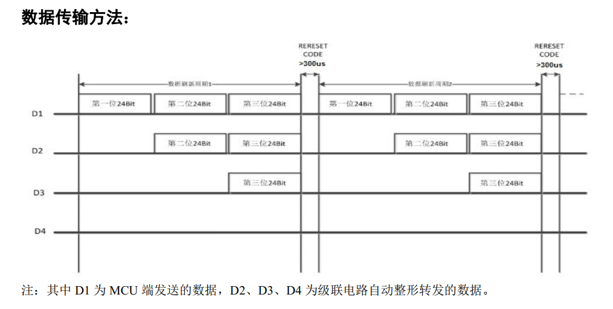
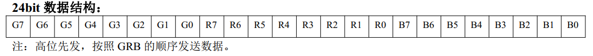
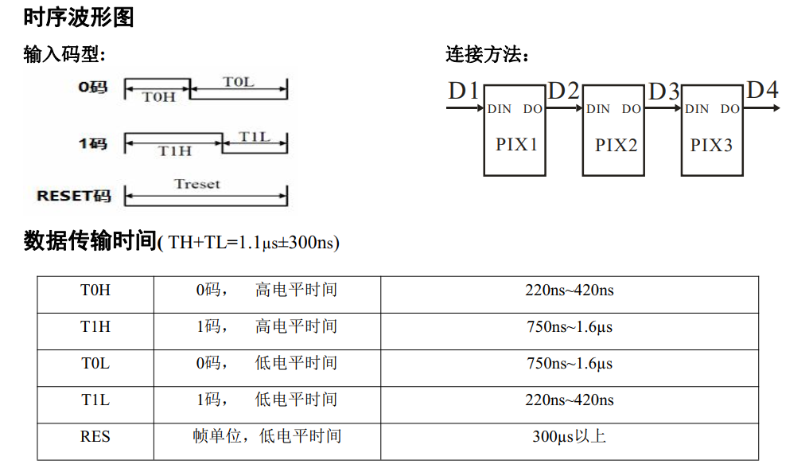
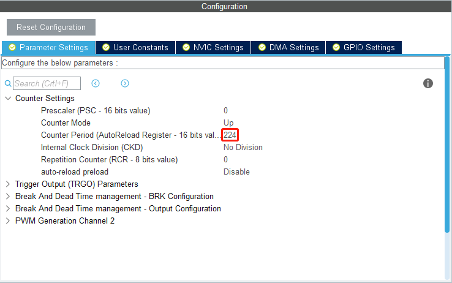
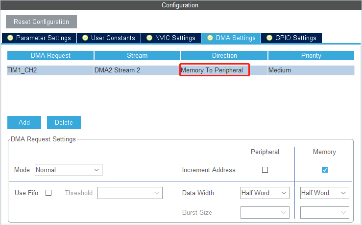

# driverLib_ws2812

<!-- TOC -->

- [driverLib_ws2812](#driverlib_ws2812)
    - [1.原理介绍](#1原理介绍)
    - [2.代码说明](#2代码说明)
        - [2.1 配置部分](#21-配置部分)
                - [PWM配置：](#pwm配置)
                - [DMA配置：](#dma配置)
        - [2.2 代码部分](#22-代码部分)

<!-- /TOC -->

## 1.原理介绍
WS2812的数据协议采用单线归零码的通讯方式，像素点在上电复位以后，DIN端接受从控制器传输过来的数据， 首先送过来的24bit数据被第一个像素点提取后， 送到像素点内部的数据锁存器，剩余的数据经过内部整形处理电路整形放大后通过DO端口开始转发输出给下一个级联的像素点，每经过一个像素点的传输，信号减少24bit。具体的数据传输方法如下：


<br><br>                        

<br><br>  
  

## 2.代码说明

### 2.1 配置部分
这里使用的DMA+PWM发送的单线数据的方式，根据ws2812的规格书说明可知其数据发送速度可达800Kbps，假设MCU的时钟频率为180MHZ，PWM对应定时器不分频的情况下，Period配置为 225-1 (180MHZ/800K=225); DMA需要设置方向为Memory To Peripheral。

##### PWM配置：


##### DMA配置：


### 2.2 代码部分
当ws2812的数据发送速度为800Kbps时，即周期时间为1.25us(1/800K)，根据时序波形图可知设数据1的高电平T1H为0.85us时，数据1的高电平H0H为0.4us,转化为pulse数据得 *BIT_1为153*(225/1.25x0.85)，*BIT_0为75*(225/1.25x0.4).

```c
#define BIT_1   153
#define BIT_0   75
```

发送颜色数据到ws2812
```c
#define PIXEL_MAX   39    //灯珠最大数量

typedef struct
{
    uint16_t head[3];    //先发送3个0等待DMA稳定
    uint16_t data[24 * PIXEL_MAX];
    uint16_t tail[3];
} frame_buff_t;

frame_buff_t frame;
#define FRAME_SIZE  sizeof(frame_buff_t)/2

void ws2812_write(uint8_t (*color)[3], uint16_t len)
{
    uint16_t i;
    uint8_t j;
    for(i=0; i<len; i++)
    {
        for(j=0; j<8; j++)
        {
            frame.data[24*i+j] = (color[i][1] & (0x80>>j))?BIT_1:BIT_0;
            frame.data[24*i+j+8] = (color[i][0] & (0x80>>j))?BIT_1:BIT_0;
            frame.data[24*i+j+16] = (color[i][2] & (0x80>>j))?BIT_1:BIT_0;
        }
    }
    
    memset(frame.head, 0, 3);
    memset(frame.tail, 0, 3);

    HAL_TIM_PWM_Start_DMA(&htim1, TIM_CHANNEL_2, (uint32_t *)&frame, FRAME_SIZE);
    HAL_Delay(2);
    HAL_TIM_PWM_Start_DMA(&htim1, TIM_CHANNEL_2, (uint32_t *)&frame, FRAME_SIZE); //再发一次保证显示
}
```

要注意需要在每次PWM发送脉冲完成回调函数里把PWM关闭，不然DMA会一直发送数据
```c
void HAL_TIM_PWM_PulseFinishedCallback(TIM_HandleTypeDef *htim)
{
    HAL_TIM_PWM_Stop(&htim1,TIM_CHANNEL_2);
}
```